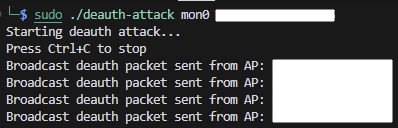
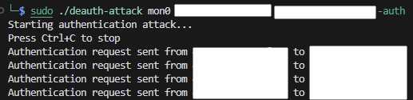

# deauth_attack
BOB13th dev deauth attack

# Deauth Attack Project

무선 네트워크 환경에서 Deauthentication/Authentication 공격을 수행하는 도구입니다.

## 기능

### 1. Deauthentication 공격


Deauthentication 공격은 두 가지 모드로 동작합니다:

#### 브로드캐스트 모드
- AP의 모든 연결된 클라이언트에 대해 Deauth 프레임을 전송
- AP MAC 주소만 지정하여 실행
- 프레임 구조:
  - Source: AP MAC
  - Destination: Broadcast MAC (FF:FF:FF:FF:FF:FF)
  - BSSID: AP MAC

#### 유니캐스트 모드
- 특정 클라이언트를 대상으로 양방향 Deauth 프레임 전송
- AP MAC과 Station MAC 모두 지정
- 프레임 구조:
  1. AP → Station
     - Source: AP MAC
     - Destination: Station MAC
     - BSSID: AP MAC
  2. Station → AP
     - Source: Station MAC
     - Destination: AP MAC
     - BSSID: AP MAC

[Deauth Attack 동작 영상](media/deauth_attack.mp4)

### 2. Authentication 공격


Authentication 공격은 지정된 Station MAC 주소로 지속적인 인증 요청을 전송합니다:

- Open System Authentication 사용
- Authentication Sequence = 1 (Authentication Request)
- 프레임 구조:
  - Source: Station MAC
  - Destination: AP MAC
  - BSSID: AP MAC

[Auth Attack 동작 영상](media/auth_attack.mp4)

## 사용법

### 컴파일
```bash
make
```

### 실행
1. Deauth 브로드캐스트 공격:
```bash
./deauth-attack <interface> <ap mac>
```

2. Deauth 유니캐스트 공격:
```bash
./deauth-attack <interface> <ap mac> <station mac>
```

3. Authentication 공격:
```bash
./deauth-attack <interface> <ap mac> <station mac> -auth
```
